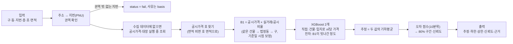

# PPT 재료

PPT 8항목별로 넣을 표·예시·그림을 모은다. 발표 자료는 `presentation/build_deck.js`가 이 문서의 내용과 `outputs/figures/`로 만든다(`presentation/AVM_발표.pptx`, 본문 22장 + 부록 8장. 요약본 `AVM_발표_요약.pptx`는 표지 + 8항목 각 1장(9장), `--summary`로 같은 스크립트에서 생성 — 목차 장에 과제 필수 8항목과 장 번호). 본문은 비전공자 기준(평가 항목: PPT만 보고 이해할 수 있는지) — 장마다 쉬운 한 줄, "읽는 법" 장, 전문 용어와 상세표는 부록. 판단과 근거 수치의 원본은 의사결정 문서에 있고 여기서는 PPT에 옮길 모양으로 정리·링크만 한다.

| PPT 항목 | 이 문서 | 원본 |
|---|---|---|
| 1 기술 스택 | §1 | `pyproject.toml`, `uv.lock` |
| 2 데이터 소스 | §2 | HANDOFF 데이터 소스, 1006_04, 1007_01～06 |
| 3 시세 요인 | — | [1007_14 쓴 변수·버린 변수](의사결정/1007_14_변수_정리.md), [1007_15 EDA](의사결정/1007_15_EDA.md) |
| 4 모델 설계 | §3 | [진행 과정](진행_과정.md), 1007_08～13 |
| 5 자체 검증 | §4 | `src/build_validation_tables.py` → `outputs/validation_*.csv`, [1007_13 오차 분석](의사결정/1007_13_오차_분석.md) |
| 6 예시 산출 | §5 | `tests/example_input.csv` → `outputs/example_output.csv` |
| 7 AI 활용 | §6 | [AI 활용 기록](AI_활용_기록.md), `AGENTS.md` |
| 8 한계와 개선안 | §7 | 1007_09·10·12·13·15 한계 |

## 1. 기술 스택

| 구분 | 사용 | 용도 |
|---|---|---|
| 언어·환경 | Python 3.12 이상(개발 3.14.5), uv(`pyproject.toml`·`uv.lock`) + pip용 `requirements.txt` | 3.12·3.13·3.14 새 환경에서 같은 출력 확인 |
| 데이터 처리 | pandas 3.0.6, numpy 2.5.3 | 수집 결과 정제, 지번(PNU) 조인, 통계 |
| 모델 | XGBoost 3.4.1, scikit-learn 1.9.1(Pipeline·GridSearchCV·GroupKFold, 비교용 Ridge·KNN·랜덤포레스트) | 최종 모델(B1 + XGBoost 보정), 모델 비교 |
| 수집 | requests 2.34.2, python-dotenv 1.2.4, openpyxl 3.1.5 | 공공 API 호출, 키는 환경변수(`.env`) |
| 분석·시각화 | Jupyter(ipykernel 7.4.0, nbconvert 7.17.1), matplotlib 3.11.2 | 노트북 01～05, 그림 |
| 버전 관리 | Git, GitHub(주제별 브랜치 → PR → 머지), 커밋 훅(`.githooks/`) | 작업 이력, 공개 저장소 |
| AI 도구 | Claude Code(Anthropic) | 수집·정제·모델링·검증·문서화 전 단계 — 상세는 PPT 7 |

| 외부 API·데이터 | 제공 | 키 |
|---|---|---|
| 연립다세대 매매·전월세 실거래가 | 국토교통부, 공공데이터포털 | `DATA_GO_KR_API_KEY` |
| 건축HUB 건축물대장 표제부 | 국토교통부, 공공데이터포털 | `DATA_GO_KR_API_KEY` |
| 공동주택가격(호별 공시가격) | 국토교통부, VWorld | `VWORLD_API_KEY` |
| 연속지적도(필지 좌표·개별공시지가) | 국토교통부, VWorld | `VWORLD_API_KEY` |
| 폐쇄말소대장 표제부(수집·정제에만, predict.py는 안 씀) | 서울특별시, 서울 열린데이터광장 | `SEOUL_OPEN_API_KEY` |
| 법정동코드, 전국도시철도역사정보, 행정동–법정동 연계표 | 공공데이터포털·행정안전부 파일 | — |

## 2. 데이터 소스

| 데이터 | 출처·수집 방식 | 기간·기준 | 받은 건수 | 정제 후 | 모델에서 |
|---|---|---|---|---|---|
| 연립다세대 매매 실거래 | 공공데이터포털 API, 구·월별 전수(받은 건수 = 응답 총건수 대조) | 2020-10 ～ 2026-10 | 36,997건 | **33,363건**(해제 2,188·낮은 이상치 331·일괄 매매 12·재건축 전 580·철거된 건물 523 제외) | 학습·비교: 최근 3년 14,401건 |
| 연립다세대 전월세 실거래 | 공공데이터포털 API | 2020-10 ～ 2026-10 | 143,109건 | — | 쓰지 않음(1007_14) |
| 공동주택가격(호별) | VWorld API, 거래 지번마다 | 2026년 공시(없으면 2025→2020 최근 연도) | 9,928개 지번 | 107,236호, 9,922개 지번(2026 9,732 + 보충 190) | B1 기준 가격, ML 변수 |
| 건축물대장 표제부 | 건축HUB API, 거래 지번마다 | 수집일 현행 대장 | 9,928개 지번(주건축물 10,594동) | 9,928개 지번(대장 9,810 · 공시가격 대체 117 · 없음 1) | 연식·승강기·층수·세대수·주차 |
| 필지 좌표·개별공시지가 | VWorld 연속지적도 API, 3개 구 전체 필지 | 2025년 공시지가 | 123,615필지 | 같음 | 좌표·땅값·역 거리 |
| 지하철역 좌표 | 전국도시철도역사정보 표준데이터(파일) | 2026-06-30 | 367개(역·노선) | 275개 역, 24개 노선 | 역 거리 |
| 법정동코드 | 국토교통부 법정동코드(파일) | 2026-06-30 | — | 3개 구 30개 동 | 주소 → 지번(PNU) |
| 폐쇄말소대장 표제부 | 서울 열린데이터광장 Open API(OA-22432), 서울 전체를 받아 3개 구만 | 수집일(2026-10-08) | 서울 383,716건 → 3개 구 51,149건 | 49,074행, 41,458개 지번 | 철거된 건물의 거래 확인·제외(1008_02) |
| 한국부동산원 연립/다세대 매매 지수 | R-ONE Open API, 주택가격동향조사(서울·서남권·동남권)·실거래가격지수(서울) | ～2026-08 / ～2026-07 | 4개 계열 873개월 | 같음 | 시점 지수 검증에만(1008_03), 모델 입력 아님 |
| 행정동–법정동 연계표 | 행정안전부 주민등록 주소코드(파일, `KIKmix`) | 2026-09-30 시행 | — | 행정동 63개 → 법정동(87행) | 행정동 이름 입력 → 법정동(1008_01) |

- 모든 조인은 법정동코드·지번(PNU)으로 하고 전후 건수를 대조했다(다르면 코드가 멈춤)
- 상용 시세 서비스 결과는 쓰지 않았다. 지오코더(Kakao·VWorld)는 결과 저장 금지라 쓰지 않고 연속지적도로 좌표를 받았다(1006_04)
- 수집 데이터에 없는 지번은 실행 중에 공시가격·표제부를 조회한다(1007_12)

## 3. 모델 흐름도

- 학습: 최근 3년 실거래 14,401건, 실행할 때마다 다시 맞춘다(하이퍼파라미터 고정, 20건 약 20초)
- 선정 과정: 기준선 B1(1007_08) → Ridge·KNN·랜덤포레스트·XGBoost × 직접/잔차/평균 13개 후보를 세 상황(처음 보는 건물·같은 건물 거래 있음·1년 뒤)에서 비교해 XGB-평균(1007_10) → 학습 기간 3·5·6년 비교로 3년(1007_13)
- 구간·신뢰도: 최종 검증과 분리한 보정 표본 1만 건의 오차로 정함(1007_09)

## 4. 자체 검증

- 검증 방식: 최근 12개월 거래가 있는 평가 권역 건물 3,159개 중 632개(20%, 시드 42)를 건물 단위로 떼어 두고, 건물마다 최근 거래 1건을 맞힌다(1007_07). 상황 A는 그 건물 거래를 모두 빼고, B는 대상 거래 이전 거래만 남긴다. 입력은 호 없음, 면적 있음/비움
- 학습에 쓰지 않은 표본: 구간·신뢰도 보정에도 쓰지 않았다(보정은 나머지 건물로)

### 4-1. 오차표 (`outputs/validation_summary.csv`)

| 상황 | 면적 | 표본 | MAPE | 중앙값 오차 | ±10% 적중 | ±20% 적중 | 80% 구간 포함 |
|---|---|---|---|---|---|---|---|
| A 처음 보는 건물 | 있음 | 632 | 13.7% | **9.4%** | 52.7% | **78.5%** | 82.9% |
| A | 비움 | 632 | 16.2% | 11.0% | 46.4% | 73.3% | 80.1% |
| B 같은 건물 과거 거래 있음 | 있음 | 632 | 13.0% | **8.6%** | 55.7% | **80.1%** | 80.7% |
| B | 비움 | 632 | 15.6% | 10.5% | 48.6% | 74.1% | 77.2% |
| 기준선 B1(공시가격 × 비율) A / B | 있음 | 632 | 15.8% / 14.7% | 11.1% / 10.7% | 45.3% / 48.1% | 71.7% / 73.9% | 69.8% / 67.7% |

- 1007_07 성공 기준(중앙값 오차 10% 이하, ±20% 적중 75% 이상, 80% 구간 포함 70～90%, 신뢰도 구간별 오차 감소, 실패 0) 모두 충족(면적 있음)

### 4-2. 권역·근거별 (면적 있음, `outputs/validation_by_group.csv`)

| 집단 | A 중앙값 오차 / ±20% | B 중앙값 오차 / ±20% | B 평균 신뢰도 |
|---|---|---|---|
| 강서 화곡동(262) | 8.4% / 79.4% | 8.4% / 80.2% | 0.81 |
| 관악구(237) | 9.3% / 81.0% | 8.3% / 84.0% | 0.81 |
| 강남구(133) | 12.7% / 72.2% | 9.7% / 72.9% | 0.70 |
| 같은 건물 근거(B, 377) | — | 8.5% / 80.6% | 0.81 |
| 법정동 근거(B, 255) | — | 9.4% / 79.2% | 0.76 |

- 강남이 가장 어렵고 신뢰도도 스스로 낮게 매긴다. 다만 강남 안에서는 신뢰도와 오차의 순위상관이 약하다(B −0.12) — 강남 안의 위험 물건은 잘 가리지 못한다(한계)

### 4-3. 신뢰도가 정직한가 (면적 있음, `outputs/validation_confidence.csv`)

| 신뢰도 구간 | A 표본 / 평균 신뢰도 / 실제 ±20% 적중 | B 표본 / 평균 신뢰도 / 실제 ±20% 적중 |
|---|---|---|
| 0.6 이하 | 73 / 0.57 / 58.9% | 47 / 0.56 / 61.7% |
| 0.6～0.7 | 120 / 0.67 / 70.8% | 94 / 0.66 / 70.2% |
| 0.7～0.8 | 171 / 0.77 / 77.2% | 137 / 0.77 / 77.4% |
| 0.8 초과 | 268 / 0.84 / 88.1% | 354 / 0.86 / 86.2% |

- 신뢰도 ≈ 실제 적중률, 대부분 실제가 같거나 약간 높다(보수적). 그림: `outputs/figures/eda_D1_pred_vs_actual_reliability.png`

### 4-4. 시점 지수 검증 (한국부동산원 지수와 비교, 1008_03)

최근 3년, 2026-06 = 100으로 맞춤. 그림 `outputs/figures/reb_index_compare.png`(PPT 부록 F), 표 `outputs/reb_index_metrics.csv`

| 우리 지수 | 비교(주택가격동향조사) | 수준 상관 | 3개월 변화 같은 방향 | 3년 변화(우리 / 부동산원) |
|---|---|---|---|---|
| 강서구 | 서남권 | 0.72 | 56% | +2.7% / +10.8% |
| 관악구 | 서남권 | 0.92 | 69% | +8.9% / +10.8% |
| 강남구 | 동남권 | 0.90 | 72% | +13.1% / +15.9% |

- 큰 흐름(2022 고점, 2023 하락, 2025～26 상승)은 같다. 강서는 2024～25년 회복을 덜 잡지만 검증에서 강서 추정이 낮게 치우치지 않아(치우침 −1%) 모델은 그대로 둔다. 공식 지수는 권역 단위라 구 단위인 우리 지수를 쓴다

### 4-5. 오차가 컸던 사례와 원인

[1007_13 §1](의사결정/1007_13_오차_분석.md) 요약(1008_02 재계산): ±20% 밖 126건의 78%가 공시가격 대비 이례적으로 싸거나 비싸게 거래된 경우, 오차 상위 15건은 모두 싼 거래를 높게 추정(11건 직거래 — 거래유형은 입력에 없음). 지하층·30년 초과는 오차가 커서 신뢰도에 반영. 사례 표: `outputs/error_top_cases.csv`, 그림: `eda_C11_dealing_type.png`

### 4-6. 하우스머치 참고 비교 (9건, 1008_04)

검증 건물 중 권역 × 신뢰도 높음·중간·낮음 1건씩(2026년 거래). 하우스머치는 사용자가 직접 조회(기준일 2026-09-01), 입력·학습에 쓰지 않음. 약관(저작권·복제 금지) 때문에 건별 하우스머치 값은 공개하지 않고 요약만 쓴다(건별 표는 `_private/`). PPT 부록 G

| | 우리(그 거래를 뺀 검증 추정) | 하우스머치 |
|---|---|---|
| 중앙값 \|오차\| 9건 / 중개 7건 | 11.1% / 9.9% | 5.6% / 4.8% |
| ±20% 안 | 6 / 9 | 7 / 9 |
| 실거래가가 범위 안 | 7 / 9(80% 구간) | 3 / 9(상하한시세) |

- 조건이 같지 않다: 우리 추정은 비교 대상 거래를 빼고 냈고, 하우스머치는 9건 중 8건이 추정 기준일(09-01) 이전 거래다. 화면을 저장한 화곡동 811-9는 하우스머치 거래사례 목록에 그 거래가 있었다. 기준일 이후 거래 1건(화곡동 362-79)도 하우스머치가 더 가까웠다
- 직거래 2건은 둘 다 높게 추정했고 우리 오차(+55%·+91%)가 더 크다 — 1007_13의 큰 오차 원인과 같다

## 5. 예시 산출 3건

권역마다 검증 건물 1건(중개거래)을 골라 입력 조건을 다르게 했다: 호 있음 / 면적 비움 / 지하층. 입력 `tests/example_input.csv`, 출력 `outputs/example_output.csv`(predict.py, 20건 규격 그대로)

실제 실행 화면(PPT 18장): 위 3건에 행정동 입력 1건(낙성대동)과 잘못된 입력 6건을 섞은 `tests/demo_errors_input.csv`를 과제 명령 그대로 실행한 Windows Terminal 캡처 `presentation/run_errors.png` — 10건, ok 4·fail 6, 실패 사유 6종(권역 밖 2, 동·지번·필지 해석 불가, 층 해석 불가)은 basis에. 주소를 해석할 수 없거나 권역 밖이면 값을 지어내거나 멈추지 않고 그 행만 실패로 남긴다

| | ① 강서 화곡동 354-41, 2층 203호, 34.01㎡ | ② 관악 봉천동 898-9, 3층, 면적 비움 | ③ 강남 일원동 661-1, 지하 1층, 49.08㎡ |
|---|---|---|---|
| 추정(하한～상한) | **2.41억** (1.99～2.84억) | **2.45억** (2.04～2.95억) | **5.45억** (4.00～7.95억) |
| 신뢰도 | 0.83 | 0.83 | 0.58(지하층·강남이라 낮음) |
| 근거(basis) | 공시가격 1.34억 × 실거래/공시 비율 1.78(같은 건물 2건+법정동, 기준일 시점보정) = 2.38억, 건물·입지 보정 ×1.01(XGBoost 잔차 2.46억·XGBoost 직접 2.36억 평균) | 공시가격 1.28억 × 비율 1.88(같은 건물 2건+법정동) = 2.40억, 건물·입지 보정 ×1.02(잔차 2.43억·직접 2.47억 평균), 면적 추정(공시가격 호 면적 39.76㎡) | 공시가격 2.05억 × 비율 2.42(같은 건물 2건+법정동) = 4.96억, 건물·입지 보정 ×1.10(잔차 5.67억·직접 5.24억 평균) |
| 참고: 이 건물의 최근 실거래 | 2026-08-13 2.70억 | 2026-01-13 2.25억(41.16㎡) | 2025-11-01 5.73억 |
| 참고: 그 거래를 뺀 검증 추정(상황 B) | 2.34억, 오차 −13.4%(80% 구간 상한 2.67억 바로 위) | 2.49억, 오차 +6.3%(면적 비움) | 5.02억, 오차 −13.7%(구간 안, 신뢰도 0.58) |

- predict.py는 수집된 모든 거래를 쓰므로 예시 물건의 최근 거래도 학습에 들어 있다. 그래서 정확도는 그 거래를 뺀 검증 추정으로 비교했다(1006_03: 특정 물건을 외워 답하는 분기는 없음)
- ②는 면적이 비어 공시가격의 같은 층 호 면적(39.76㎡)으로 채웠다 — 실제 거래 면적(41.16㎡)과 1.4㎡ 차이. 같은 층에 면적이 다른 호가 있으면 이런 차이가 생긴다
- 참고(실행 중 조회): 수집 데이터에 없는 화곡동 다세대(56-196, 1층 101호, 54.44㎡)는 키가 있으면 공시가격·대장을 조회해 1.78억(신뢰도 0.72), 키가 없으면 ㎡단가로 2.72억(신뢰도 0.10)과 "조회 못 함(키 없음)"을 basis에 적는다(1007_12)

## 6. AI 활용 내역

### 6-1. 어떻게 썼나

- 도구: **Claude Code**(터미널에서 코드를 읽고 실행하는 AI 에이전트) 하나로 전 단계를 진행. 결과 확인은 실제 실행·출력 대조로
- 일하는 규칙을 파일로 고정: [`AGENTS.md`](../AGENTS.md)(수치 지어내기 금지, 지번 조인 전후 건수 대조, 상용 시세 금지, 공개 저장소 규칙, 커밋·푸시는 사람이 요청할 때만), 결정은 [`docs/의사결정/`](의사결정/)에 선택지·근거·대안과 함께, 세션이 바뀌어도 이어지도록 `HANDOFF.md`·작업일지
- 사람이 하는 것: 결정(선택지 중 고르기), 의심하고 질문하기, 주제별 브랜치의 PR 머지, API 키 발급·제출

| 단계 | AI가 한 것 | 내가 판단·결정한 것 |
|---|---|---|
| 기획·설계 | 과제 요약, 마감 표기 충돌 발견, 감정평가 거래사례비교법을 모델 단계에 대응 | 마감·기준일 확정, 감정평가 자료 접목 제안, "같은 호 거래도 비교사례로 써도 된다" 판단 |
| 수집 | API 실제 응답으로 필드 확인, 수집 스크립트(전수·이어받기·재시도), 서버 오류 원인 확인 | 수집 범위(연립 포함·6년·지하철), 약관 문제 시 공공데이터로 교체 결정 |
| 정제 | 중복·호 표기 통일·결측·이상치 규칙, 처리 전후 건수 대조, 근거 문서 | 여러 동 처리안, 이상치 해석(싼 쪽 제외·비싼 쪽 유지), 기록 형식(방법/근거/대안/조건/결과) |
| 검증 설계·모델 | 건물 단위 홀드아웃, 기준선, 4계열 ML 비교(누수 방지·그리드서치·부트스트랩), 구간·신뢰도 보정, 실행 중 조회 | 문제 정의 순서, XGBoost 외 모델 비교 요구, 최종 모델·학습 기간 3년 결정 |
| 점검 | 데이터 전 열 범위 점검, 문서–코드 대조, 수치 재계산 | 데이터 점검·재검증을 여러 번 요청, "모델 선정에 영향을 줬나" 같은 질문 |
| 문서·시각화 | 의사결정 문서 24건, 용어사전, 진행 과정 길잡이, EDA 그림 19개, PPT 재료 | 그림·문서 확인, 공개 범위 결정 |

### 6-2. AI가 틀린 것과 잡은 방법

| 잡은 방법 | AI가 틀린 것 | 결과 |
|---|---|---|
| **원문·약관 대조** | 지하철역 좌표를 Kakao API로 받아 저장하고 공개 저장소에 올림 — Kakao는 결과 저장 금지 | 공공데이터 역 정보로 교체, 이력 정리(1006_04) |
| | 과제 규격의 "수집에 없는 물건은 실행 중 조회"를 놓치고 "외부 API를 부르지 않는다"로 설계 | 실행 중 조회 구현, 15개 지번으로 같은 값인지 확인(1007_12) |
| **값 범위·분포 점검** | 이상치 규칙이 과거 연도 공시가격 거래의 26%를 비싼 이상치로 잘못 표시 | 판정 기준 분리 → 0.4%(1007_05) |
| | 연식 계산이 6자리 사용승인일을 연도 20으로 읽음(연식 2006년) | 수정(1007_11) |
| | 필지 중심점 계산의 자릿수 손실로 좌표가 필지 밖 58m | 원점 이동 후 재수집(1007_06) |
| **실행해서 확인** | 호 비교 코드 버그로 호가 있는 입력 18/20건 처리 오류, 규격 검사기가 이를 "통과"로 판정 | 코드 수정, 검사 항목 강화 |
| | 실행 중 조회가 건축HUB 서버 503을 처리 못 해 10개 중 6개 실패 | 원 응답 확인 후 재시도 추가 |
| | 검증 노트북이 실행할 때마다 검증 건물을 다시 뽑아, 데이터를 고치자 632개 중 약 400개가 바뀜 | 실행 뒤 파일 변경을 보고 발견, 되돌리고 고정 파일을 읽게 수정(1008_02) |
| **하나씩 열어 보기** | 일괄 매매 규칙이 정상 거래(신축 분양 등)까지 133건 잡음 | ㎡당 가격 일관성으로 12건으로 좁힘(1007_11) |
| **수치 대조** | 그림 제목 6개를 데이터 보기 전에 써서 실제와 다름(강남 가격 배수, 연식 순서 등) | 출력 표와 대조해 정정(1007_15) |
| | 공시가격 없는 추정의 신뢰도 상한 0.30 — 실제 적중률 10% | 0.10으로 고정(1007_09) |
| **사람의 질문** | 수집 기간 3년을 근거 없이 제안 / 같은 호 거래에 위험을 과대평가해 특별 규칙 권함 | 6년 수집 후 검증으로 3년 결정 / 특별 규칙 없이 처리(1006_03) |
| **과제 명령으로 실행** | predict.py가 UTF-8 입력만 읽어 엑셀로 저장한 CP949 파일이면 전체가 멈춤 | 두 인코딩 읽기, 엑셀 형식 시험 파일 추가(1008_05) |
| **사람의 질문** | 하우스머치 건별 값을 약관 확인 없이 공개 저장소에 넣음 | 약관(저작권·복제 금지) 확인 후 요약만 공개(1008_04) |

- 공통점: AI의 출력을 그대로 쓰지 않고 **실행 결과·원본 수치·원문과 대조**하는 단계를 넣었을 때 잡혔다. 그래서 점검을 단계마다 따로 요청했다

### 6-3. AI 없이 했다면

- **파이썬 5개월 차인 나 혼자라면 같은 범위에 약 2.5～3.5개월**(실제 3일). 사용자 판단, 단계별 추정 근거는 아래

| 단계 | 처음 익혀야 했을 것 | 경험자 기준 → 5개월 차 기준 |
|---|---|---|
| 수집 | API 인증, JSON 응답 구조, 페이지 넘기기, 서버 오류 재시도, 한도 관리 | 1주 → 2～3주 |
| 정제 | pandas 조인과 건수 검증, 정규식(호 표기 통일), 수정 Z-점수, 좌표 계산 | 1주 → 2～3주 |
| 검증 설계 | 데이터 누수, 건물 단위 분할, 시점 보정 | 0.5주 → 1～2주 |
| 모델 | scikit-learn Pipeline·GroupKFold·GridSearchCV, XGBoost, 부트스트랩, 구간·신뢰도 보정 | 1～1.5주 → 3～4주 |
| 점검·문서·발표 | 시각화, Git 브랜치·PR, 문서 체계, PPT | 1～1.5주 → 2주 |

- 범위를 줄였다면(모델 비교 없이 하나, 단순 신뢰도 규칙, 실행 중 조회·전수 점검 생략) 5～6주
- AI가 줄인 것은 구현 시간이다. 무엇을 할지 고르고 결과를 의심하는 일은 직접 했다(§6-1·6-2)

## 7. 한계와 개선안

### 7-1. 한계

| 한계 | 근거 |
|---|---|
| 공시가격 대비 이례적인 거래(직거래·급매·고가 프리미엄)는 입력으로 구별할 수 없어 크게 틀리고, 신뢰도도 낮추지 못함 | ±20% 밖의 78%, 공시 대비 싸게 거래된 집단 평균 신뢰도 0.78 vs 실제 적중 28%(1007_13, 1008_02 재계산) |
| 싼 물건은 높게, 비싼 물건은 낮게 추정(평균으로 끌림) | 1.5억 이하 +17%, 7억 초과 −9%(1007_13, 1008_02 재계산) |
| 강남 안에서는 신뢰도가 위험한 물건을 잘 가리지 못함 | 강남 신뢰도-오차 순위상관 −0.12(§4-2) |
| 호를 넣은 입력의 정확도는 검증하지 못함 | 실거래에 호가 없어 검증 입력은 모두 호 없음(1007_09) |
| 공시가격이 없는 물건(㎡단가 추정)은 정확도가 낮음 | 보정 표본 ±20% 적중 10%, 신뢰도 0.10(1007_09) |
| 실행 중 조회한 물건의 정확도는 따로 검증 못 함 | 그런 물건은 실거래가 없어 정답이 없음(1007_12) |
| 모델·학습 기간을 같은 검증 세트로 골라 성적이 조금 낙관적일 수 있음 | 보정 표본(최종 검증과 분리)에서도 같은 방향을 확인해 줄임(1007_10·13) |
| 시간이 지나면 낮게 추정 | 1년 전 모델로 맞히면 3～5% 낮음(1007_10 상황 T) |
| 시점 지수가 최근 변화를 늦게 반영 | 구·월별 중앙값의 3개월 이동평균이라 변화가 늦게 잡히고, 신고기한 전이라 거래가 덜 들어온 2026-09·10월은 빼고 2026-08을 기준으로 삼아 그 뒤 두 달의 움직임은 반영되지 않음(1007_05·08, `src/avm.py` `TimeIndex`) |

### 7-2. 실제 서비스에 붙이려면

| 개선 | 내용 |
|---|---|
| 데이터 자동 갱신 | 실거래 월 1회·공시가격 연 1회 수집을 자동화하고 실행마다 다시 맞추는 지금 구조를 유지. 1년 지나면 3～5% 낮아지므로 최소 월 단위 갱신 |
| 모델 모니터링 | 새로 들어온 실거래로 매달 오차·신뢰도 적중을 다시 재고, 기준(±20% 75%)을 밑돌면 재학습·재보정 |
| 이상 거래 탐지 | 직거래·특수관계 거래를 학습에서 가려내는 규칙, 등기부(소유권 이전 원인) 등 추가 자료 |
| 호 단위 정보 | 전유부(호별 면적·용도), 내부 상태·리모델링, 방향·조망 — 지금은 같은 층 호를 구별하지 못함 |
| 생활 시설 변수 | 학교·공원·상권·버스 정류장 거리, 소음 — 지금은 땅값·좌표가 대신 |
| 반경 비교사례 | 근거 문장에 "반경 500m 비슷한 면적 최근 N건 대비"처럼 감정평가식 비교사례를 함께 보여 설명력 강화 |
| 가격대별 보정 | 평균으로 끌리는 경향을 별도 검증 표본으로 보정, 강남 고가는 별도 모델 검토 |
| 운영 | 지금은 실행마다 20건 약 20초 학습 → 서비스는 학습한 모델을 저장해 두고 요청마다 즉시 응답, API 장애 대비 캐시 |
