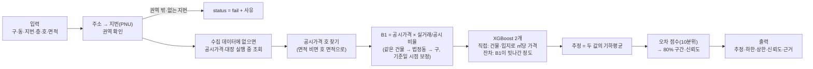

# PPT 재료

PPT 8항목별로 넣을 표·예시·그림을 모은다. 판단과 근거 수치의 원본은 의사결정 문서에 있고 여기서는 PPT에 옮길 모양으로 정리·링크만 한다.

| PPT 항목 | 이 문서 | 원본 |
|---|---|---|
| 1 기술 스택 | §1 | `pyproject.toml`, `uv.lock` |
| 2 데이터 소스 | §2 | HANDOFF 데이터 소스, 1006_04, 1007_01~06 |
| 3 시세 요인 | — | [1007_14 쓴 변수·버린 변수](의사결정/1007_14_변수_정리.md), [1007_15 EDA](의사결정/1007_15_EDA.md) |
| 4 모델 설계 | §3 | [진행 과정](진행_과정.md), 1007_08~13 |
| 5 자체 검증 | §4 | `src/build_validation_tables.py` → `outputs/validation_*.csv`, [1007_13 오차 분석](의사결정/1007_13_오차_분석.md) |
| 6 예시 산출 | §5 | `tests/example_input.csv` → `outputs/example_output.csv` |
| 7 AI 활용 | (다음 작업) | [AI 활용 기록](AI_활용_기록.md) |
| 8 한계와 개선안 | (다음 작업) | 1007_12·13·14 한계 |

## 1. 기술 스택

| 구분 | 사용 | 용도 |
|---|---|---|
| 언어·환경 | Python 3.12 이상(개발 3.14.5), uv(`pyproject.toml`·`uv.lock`) + pip용 `requirements.txt` | 3.12·3.13·3.14 새 환경에서 같은 출력 확인 |
| 데이터 처리 | pandas 3.0.6, numpy 2.5.3 | 수집 결과 정제, 지번(PNU) 조인, 통계 |
| 모델 | XGBoost 3.4.1, scikit-learn 1.9.1(Pipeline·GridSearchCV·GroupKFold, 비교용 Ridge·KNN·랜덤포레스트) | 최종 모델(B1 + XGBoost 보정), 모델 비교 |
| 수집 | requests 2.34.2, python-dotenv 1.2.4, openpyxl 3.1.5 | 공공 API 호출, 키는 환경변수(`.env`) |
| 분석·시각화 | Jupyter(ipykernel 7.4.0, nbconvert 7.17.1), matplotlib 3.11.2 | 노트북 01~05, 그림 |
| 버전 관리 | Git, GitHub(주제별 브랜치 → PR → 머지), 커밋 훅(`.githooks/`) | 작업 이력, 공개 저장소 |
| AI 도구 | Claude Code(Anthropic) | 수집·정제·모델링·검증·문서화 전 단계 — 상세는 PPT 7 |

| 외부 API·데이터 | 제공 | 키 |
|---|---|---|
| 연립다세대 매매·전월세 실거래가 | 국토교통부, 공공데이터포털 | `DATA_GO_KR_API_KEY` |
| 건축HUB 건축물대장 표제부 | 국토교통부, 공공데이터포털 | `DATA_GO_KR_API_KEY` |
| 공동주택가격(호별 공시가격) | 국토교통부, VWorld | `VWORLD_API_KEY` |
| 연속지적도(필지 좌표·개별공시지가) | 국토교통부, VWorld | `VWORLD_API_KEY` |
| 법정동코드, 전국도시철도역사정보 | 공공데이터포털 파일 | — |

## 2. 데이터 소스

| 데이터 | 출처·수집 방식 | 기간·기준 | 받은 건수 | 정제 후 | 모델에서 |
|---|---|---|---|---|---|
| 연립다세대 매매 실거래 | 공공데이터포털 API, 구·월별 전수(받은 건수 = 응답 총건수 대조) | 2020-10 ~ 2026-10 | 36,997건 | **33,886건**(해제 2,188·낮은 이상치 331·일괄 매매 12·재건축 전 580 제외) | 학습·비교: 최근 3년 14,520건 |
| 연립다세대 전월세 실거래 | 공공데이터포털 API | 2020-10 ~ 2026-10 | 143,109건 | — | 쓰지 않음(1007_14) |
| 공동주택가격(호별) | VWorld API, 거래 지번마다 | 2026년 공시(없으면 2025→2020 최근 연도) | 9,928개 지번 | 107,236호, 9,922개 지번(2026 9,732 + 보충 190) | B1 기준 가격, ML 변수 |
| 건축물대장 표제부 | 건축HUB API, 거래 지번마다 | 수집일 현행 대장 | 9,928개 지번(주건축물 10,594동) | 9,928개 지번(대장 9,810 · 공시가격 대체 117 · 없음 1) | 연식·승강기·층수·세대수·주차 |
| 필지 좌표·개별공시지가 | VWorld 연속지적도 API, 3개 구 전체 필지 | 2025년 공시지가 | 123,615필지 | 같음 | 좌표·땅값·역 거리 |
| 지하철역 좌표 | 전국도시철도역사정보 표준데이터(파일) | 2026-06-30 | 367개(역·노선) | 275개 역, 24개 노선 | 역 거리 |
| 법정동코드 | 국토교통부 법정동코드(파일) | 2026-06-30 | — | 3개 구 30개 동 | 주소 → 지번(PNU) |

- 모든 조인은 법정동코드·지번(PNU)으로 하고 전후 건수를 대조했다(다르면 코드가 멈춤)
- 상용 시세 서비스 결과는 쓰지 않았다. 지오코더(Kakao·VWorld)는 결과 저장 금지라 쓰지 않고 연속지적도로 좌표를 받았다(1006_04)
- 수집 데이터에 없는 지번은 실행 중에 공시가격·표제부를 조회한다(1007_12)

## 3. 모델 흐름도

- 학습: 최근 3년 실거래 14,520건, 실행할 때마다 다시 맞춘다(하이퍼파라미터 고정, 20건 약 17초)
- 선정 과정: 기준선 B1(1007_08) → Ridge·KNN·랜덤포레스트·XGBoost × 직접/잔차/평균 13개 후보를 세 상황(처음 보는 건물·같은 건물 거래 있음·1년 뒤)에서 비교해 XGB-평균(1007_10) → 학습 기간 3·5·6년 비교로 3년(1007_13)
- 구간·신뢰도: 최종 검증과 분리한 보정 표본 1만 건의 오차로 정함(1007_09)

## 4. 자체 검증

- 검증 방식: 최근 12개월 거래가 있는 평가 권역 건물 3,159개 중 632개(20%, 시드 42)를 건물 단위로 떼어 두고, 건물마다 최근 거래 1건을 맞힌다(1007_07). 상황 A는 그 건물 거래를 모두 빼고, B는 대상 거래 이전 거래만 남긴다. 입력은 호 없음, 면적 있음/비움
- 학습에 쓰지 않은 표본: 구간·신뢰도 보정에도 쓰지 않았다(보정은 나머지 건물로)

### 4-1. 오차표 (`outputs/validation_summary.csv`)

| 상황 | 면적 | 표본 | MAPE | 중앙값 오차 | ±10% 적중 | ±20% 적중 | 80% 구간 포함 |
|---|---|---|---|---|---|---|---|
| A 처음 보는 건물 | 있음 | 632 | 13.7% | **9.3%** | 52.8% | **79.0%** | 82.0% |
| A | 비움 | 632 | 16.1% | 10.9% | 46.7% | 73.7% | 80.2% |
| B 같은 건물 과거 거래 있음 | 있음 | 632 | 13.0% | **9.0%** | 54.6% | **80.2%** | 79.7% |
| B | 비움 | 632 | 15.6% | 10.7% | 47.5% | 75.0% | 77.8% |
| 기준선 B1(공시가격 × 비율) A / B | 있음 | 632 | 15.8% / 14.7% | 11.1% / 10.6% | 45.1% / 48.3% | 71.7% / 73.9% | 69.8% / 67.6% |

- 1007_07 성공 기준(중앙값 오차 10% 이하, ±20% 적중 75% 이상, 80% 구간 포함 70~90%, 신뢰도 구간별 오차 감소, 실패 0) 모두 충족(면적 있음)

### 4-2. 권역·근거별 (면적 있음, `outputs/validation_by_group.csv`)

| 집단 | A 중앙값 오차 / ±20% | B 중앙값 오차 / ±20% | B 평균 신뢰도 |
|---|---|---|---|
| 강서 화곡동(262) | 8.0% / 79.4% | 8.6% / 79.8% | 0.82 |
| 관악구(237) | 9.2% / 81.4% | 9.0% / 83.5% | 0.81 |
| 강남구(133) | 12.8% / 73.7% | 9.3% / 75.2% | 0.70 |
| 같은 건물 근거(B, 377) | — | 9.0% / 80.6% | 0.81 |
| 법정동 근거(B, 255) | — | 8.9% / 79.6% | 0.76 |

- 강남이 가장 어렵고 신뢰도도 스스로 낮게 매긴다. 다만 강남 안에서는 신뢰도와 오차의 순위상관이 거의 없다(B −0.07) — 강남 안의 위험 물건은 잘 가리지 못한다(한계)

### 4-3. 신뢰도가 정직한가 (면적 있음, `outputs/validation_confidence.csv`)

| 신뢰도 구간 | A 표본 / 평균 신뢰도 / 실제 ±20% 적중 | B 표본 / 평균 신뢰도 / 실제 ±20% 적중 |
|---|---|---|
| 0.6 이하 | 53 / 0.57 / 66.0% | 44 / 0.57 / 59.1% |
| 0.6~0.7 | 136 / 0.65 / 64.7% | 97 / 0.65 / 70.1% |
| 0.7~0.8 | 247 / 0.78 / 83.4% | 185 / 0.78 / 81.1% |
| 0.8 초과 | 196 / 0.86 / 86.7% | 306 / 0.87 / 85.9% |

- 신뢰도 ≈ 실제 적중률, 대부분 실제가 같거나 약간 높다(보수적). 그림: `outputs/figures/eda_D1_pred_vs_actual_reliability.png`

### 4-4. 오차가 컸던 사례와 원인

[1007_13 §1](의사결정/1007_13_오차_분석.md) 요약: ±20% 밖의 77%가 공시가격 대비 이례적으로 싸거나 비싸게 거래된 경우, 오차 상위 15건은 모두 싼 거래를 높게 추정(10건 직거래 — 거래유형은 입력에 없음). 지하층·30년 초과는 오차가 커서 신뢰도에 반영. 사례 표: `outputs/error_top_cases.csv`, 그림: `eda_C11_dealing_type.png`

## 5. 예시 산출 3건

권역마다 검증 건물 1건(중개거래)을 골라 입력 조건을 다르게 했다: 호 있음 / 면적 비움 / 지하층. 입력 `tests/example_input.csv`, 출력 `outputs/example_output.csv`(predict.py, 20건 규격 그대로)

| | ① 강서 화곡동 354-41, 2층 203호, 34.01㎡ | ② 관악 봉천동 898-9, 3층, 면적 비움 | ③ 강남 일원동 661-1, 지하 1층, 49.08㎡ |
|---|---|---|---|
| 추정(하한~상한) | **2.43억** (1.97~2.98억) | **2.47억** (2.00~3.03억) | **5.30억** (3.81~7.53억) |
| 신뢰도 | 0.80 | 0.80 | 0.59(지하층·강남이라 낮음) |
| 근거(basis) | 공시가격 1.34억 × 실거래/공시 비율 1.78(같은 건물 2건+법정동, 기준일 시점보정) = 2.38억, 건물·입지 보정 ×1.02(XGBoost 잔차 2.51억·XGBoost 직접 2.36억 평균) | 공시가격 1.28억 × 비율 1.88(같은 건물 2건+법정동) = 2.40억, 건물·입지 보정 ×1.03(잔차 2.45억·직접 2.50억 평균), 면적 추정(공시가격 호 면적 39.76㎡) | 공시가격 2.05억 × 비율 2.42(같은 건물 2건+법정동) = 4.96억, 건물·입지 보정 ×1.07(잔차 5.23억·직접 5.37억 평균) |
| 참고: 이 건물의 최근 실거래 | 2026-08-13 2.70억 | 2026-01-13 2.25억(41.16㎡) | 2025-11-01 5.73억 |
| 참고: 그 거래를 뺀 검증 추정(상황 B) | 2.33억, 오차 −13.6%(80% 구간 상한 2.67억 바로 위) | 2.52억, 오차 +7.3%(면적 비움) | 4.98억, 오차 −14.2%(구간 안, 신뢰도 0.59) |

- predict.py는 수집된 모든 거래를 쓰므로 예시 물건의 최근 거래도 학습에 들어 있다. 그래서 정확도는 그 거래를 뺀 검증 추정으로 비교했다(1006_03: 특정 물건을 외워 답하는 분기는 없음)
- ②는 면적이 비어 공시가격의 같은 층 호 면적(39.76㎡)으로 채웠다 — 실제 거래 면적(41.16㎡)과 1.4㎡ 차이. 같은 층에 면적이 다른 호가 있으면 이런 차이가 생긴다
- 참고(실행 중 조회): 수집 데이터에 없는 화곡동 다세대(56-196, 1층 101호, 54.44㎡)는 키가 있으면 공시가격·대장을 조회해 1.78억(신뢰도 0.72), 키가 없으면 ㎡단가로 2.72억(신뢰도 0.10)과 "조회 못 함(키 없음)"을 basis에 적는다(1007_12)
