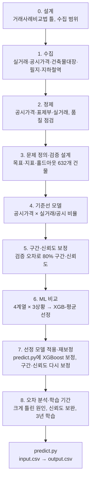
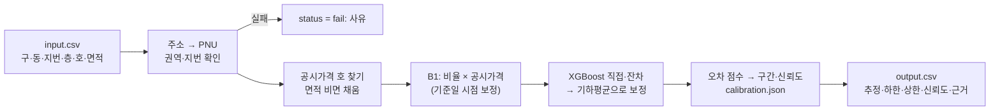

# 진행 과정 — 무엇을, 어떻게, 왜

이 문서는 프로젝트 전체를 처음부터 따라가는 **길잡이**다. 단계마다 무엇을 했고, 어떻게 했고, 왜 그렇게 했는지를 짧게 적고, 자세한 근거·대안·수치는 각 단계의 의사결정 문서(`docs/의사결정/`)로 연결한다.

- 현재 상태와 다음 작업: [`HANDOFF.md`](../HANDOFF.md)
- 날짜별로 한 일: [`docs/작업일지/`](작업일지/)
- AI가 한 일·내가 판단한 일·AI가 틀린 것: [`docs/AI_활용_기록.md`](AI_활용_기록.md)

## 한눈에 보기

## 먼저 알아 둘 말

| 말 | 뜻 |
|---|---|
| PNU | 필지 고유번호(19자리) = 법정동코드 10 + 대지/산 1 + 본번 4 + 부번 4. 주소를 동 이름이 아니라 이 번호로 연결한다 |
| 공시가격 | 정부가 매년 호마다 매기는 공동주택 가격. 시세보다 낮지만 위치·면적·연식·층 차이를 이미 담고 있다 |
| 실거래/공시 비율 | 실거래가 ÷ 그 호의 공시가격. 이 지역은 약 1.7배. 모델의 핵심 값 |
| 시점 보정 | 과거 거래가를 기준일(2026-10-06) 시세 수준으로 옮기는 것 |
| 홀드아웃 | 모델을 만들 때 일부러 빼 둔 건물. 이 건물로 오차를 재야 "처음 보는 물건"에 대한 실력을 알 수 있다 |
| 상황 A / B | A: 그 건물의 거래를 전부 뺀 경우(처음 보는 건물) / B: 그 건물의 과거 거래는 남긴 경우(실제와 더 비슷함) |
| APE | 오차율 = \|추정 − 실제\| ÷ 실제 |
| 80% 구간 | `price_low`～`price_high`. 실제 가격이 열에 여덟은 이 안에 들어야 정직하다 |
| 신뢰도 | `confidence`. 이 프로젝트에서는 "비슷한 조건의 추정이 실거래가 ±20% 안에 든 비율" |

---

## 0. 설계 — 어떤 틀로 시세를 낼까

**무엇을**: 모델의 큰 틀과 데이터 범위를 먼저 정했다.

**어떻게**
- 감정평가 실무에서 빌라 같은 구분건물을 평가하는 **거래사례비교법**을 틀로 삼았다. 비슷한 거래를 찾아 시점·층·연식 등의 차이를 보정하는 방식이다
- 이론에서는 "어떤 요인을 볼지"만 가져오고, 각 요인의 크기는 실거래 데이터로 정하기로 했다
- 수집 범위: 다세대에 연립까지, 6년치(2020-10～2026-10), 권역 밖 강서구도 비교사례용으로, 전월세는 보조 근거로만

**왜**
- 면접에서 "왜 이 구조인가"를 실무 기준으로 설명할 수 있다
- 빌라는 건물당 거래가 드물어(지번당 평균 3.7건) 기간을 넓게 받아야 같은 건물 사례가 생긴다

**함께 정한 원칙**: 입력과 같은 거래를 찾아 그 값을 그대로 돌려주는 분기는 만들지 않는다. 같은 건물 과거 거래는 다른 거래와 똑같이 근거 중 하나로 쓴다.

→ [1006_02 모델 틀](의사결정/1006_02_모델_틀_거래사례비교법.md) · [1006_03 외워두기 해석](의사결정/1006_03_외워두기_유의사항_해석.md) · [1006_04 수집 범위](의사결정/1006_04_수집_범위.md) · [1006_01 협업 템플릿](의사결정/1006_01_협업_템플릿_적용.md)

## 1. 수집 — 무엇을 어디서 받았나

| 데이터 | 출처 | 쓰임 | 코드 |
|---|---|---|---|
| 연립다세대 매매·전월세 실거래 | 국토교통부(data.go.kr) | 정답 가격, 비교사례, 시점 지수 | `src/collect_trades.py` |
| 공동주택 공시가격(호별) | 국토교통부(VWorld) | 모델의 기준 가격 | `src/collect_buildings.py` |
| 건축물대장 표제부 | 건축HUB(data.go.kr) | 승강기·층수·세대수 등 건물 정보 | `src/collect_buildings.py` |
| 필지 중심점·개별공시지가 | 연속지적도 API(VWorld) | 위치, 역 거리 | `src/collect_parcels.py` |
| 지하철역 좌표 | 전국도시철도역사정보 표준데이터 | 역 거리 | `src/build_stations.py` |
| 법정동코드 | 국토교통부 법정동 파일 | 동 이름 → 코드 → PNU | 파일 다운로드 |

**어떻게 확인했나**: AI가 알려준 API 주소·필드명을 그대로 믿지 않고 실제 응답으로 확인했다(`src/probe_apis.py`). 서버 시간 초과로 실패한 1,736개 지번은 재시도 대기를 넣어 다시 받았다.

**이용약관 때문에 바꾼 것**: 처음에는 지하철역 좌표를 Kakao API로 받아 저장했는데, Kakao·VWorld 지오코더는 **결과 저장이 금지**라는 것을 확인했다. 그래서 역 좌표는 공공 표준데이터로, 거래 지번 좌표는 저장이 허용된 연속지적도 API로 바꿨다.

→ [1006_04 5절 지하철역 교체](의사결정/1006_04_수집_범위.md) · [1007_06 필지 좌표](의사결정/1007_06_필지_좌표.md)

## 2. 정제 — 모델에 넣을 수 있는 모양으로

정제는 "받은 그대로는 연결이 안 되거나 틀린 값이 섞인 데이터"를 바로잡는 단계다. 단계마다 처리 전후 건수를 대조했고, 조인 전후 건수가 다르면 코드가 멈추게 했다.

| 대상 | 문제 | 처리 | 문서 |
|---|---|---|---|
| 공시가격 | 같은 행이 2번씩 옴, 2026년 공시가 없는 지번, 호 표기가 제각각(`3층301호`, `비01`, `지층지1` …) | 중복 제거, 과거 연도로 보충, 호 표기 통일(`ho_key`) | [1007_03](의사결정/1007_03_공시가격_정제.md) |
| 건축물대장 | 한 지번에 건물이 여러 동, 상가 동이 섞임 | 지번 단위로 합치고 다세대·연립 동만 사용 | [1007_01](의사결정/1007_01_표제부_여러동_처리.md) |
| 건축물대장 | 대장이 없는 지번(대부분 철거 추정) | 공시가격으로 층수·세대수만 채우고 나머지는 비워 두며 출처 표시 | [1007_02](의사결정/1007_02_건물정보_결측_처리.md) |
| 실거래 | 법정동코드 없음, 해제 거래, 이상하게 싸거나 비싼 거래 | 법정동코드표로 PNU 생성, 해제 제외, 이상치 판정 | [1007_04](의사결정/1007_04_실거래_정제.md) |

**이상치를 어떻게 정했나** (가장 판단이 많이 들어간 부분)
- 기준: 실거래/공시 비율이 같은 구·같은 해 거래들과 얼마나 다른가(수정 Z-점수, 기준 3.5)
- **너무 싼 거래는 뺐다**: 가족 간 직거래·지분 거래처럼 사정이 개입된 가격으로 본다
- **너무 비싼 거래는 남기고 표시만 했다**: 노후·철거 예정 건물이 많아 재개발 기대 가격으로 본다. 빼면 이런 건물 시세를 낮게 추정하게 된다

**품질 점검**: 정제 결과를 다시 검증하다가, 과거 연도 공시가격이 붙은 거래의 26%가 비싼 이상치로 잘못 표시되는 문제를 발견해 고쳤다(0.4%로 감소). 다중공선성(VIF)도 확인해 연식과 건축년도 중 연식만, 세대수와 동 수 중 세대수만 쓰기로 했다.

→ [1007_05 품질 점검](의사결정/1007_05_데이터_품질_점검.md)

**모델을 고른 뒤 다시 점검**: 학습 데이터 전체의 값 범위를 다시 훑어, 정제 때 놓친 두 가지를 찾아 뺐다. 같은 지번에서 **재건축 전 옛 건물의 거래**(580건)가 새 건물 정보로 학습되던 것, 여러 호를 한 번에 사서 **합계 금액이 호마다 적힌 일괄 매매**(12건)다. 건물 변수의 세대수 0·층수 0·과도한 주차 대수는 "모름"(결측)으로 바꿨다. 성적은 거의 같았고 모델 선정도 바뀌지 않았다 — 점수가 아니라 데이터가 실제를 맞게 담도록 고친 것이다.

→ [1007_11 학습 데이터 점검](의사결정/1007_11_학습_데이터_점검.md)

**철거된 건물의 거래 빼기(10-08)**: 현행 건축물대장에 건물이 없는 지번 114개는 "거래 뒤 철거된 건물"로 짐작만 하고 거래를 남겨 두었었다(1007_02). 서울시 폐쇄말소대장을 받아 대조하니 113개가 실제로 말소된 건물이었다. 그래서 말소일 이전 거래 523건을 뺐다(재건축을 위해 한 건물을 한꺼번에 사들인 거래가 많았다). 같은 지번에 새로 지은 건물의 거래(20건)는 남겼다. 정확도는 거의 같고(±20% 적중 A 79.0% → 78.5%, B 80.2% → 80.1%) 신뢰도가 오차를 가리는 힘은 조금 좋아졌다.

→ [1008_02 철거된 건물 거래](의사결정/1008_02_철거된_건물_거래.md)

**결과물**: `data/processed/`(실거래 `trades.csv`, 공시가격 `apt_price.csv`, 건물 정보 `bld_title.csv`)와 `data/reference/`(필지·역·법정동). `predict.py`는 이 파일을 읽고, 입력 지번이 여기에 없을 때만 공시가격·건축물대장을 실행 중에 조회한다(키가 없으면 조회 없이 계속, [1007_12](의사결정/1007_12_실행_중_조회.md)).

## 3. 문제 정의·검증 설계 — 모델보다 먼저 채점 방식을 고정

**무엇을**: 모델을 만들기 전에 무엇을 맞힐지, 어떻게 채점할지, 어떤 데이터로 시험할지를 먼저 고정했다.

**어떻게**
- 예측 대상: 기준일(2026-10-06) 기준 호 단위 매매 시세
- 지표: 오차율(중앙값·평균), ±10%·±20% 안에 든 비율, 80% 구간 포함률, 신뢰도가 높을수록 오차가 작은지
- 홀드아웃: 최근 12개월 거래가 있는 평가 권역 건물 3,159개 중 20%(632개)를 무작위로 뽑아 **건물 단위로** 시험용으로 고정 → `data/processed/holdout_pnu.csv`
- 두 상황(A 처음 보는 건물 / B 같은 건물 과거 거래 있음)을 함께 본다

**왜**
- 결과를 보고 나서 채점 방식을 고르면 좋은 숫자만 남기게 된다(데이터 누수)
- 블라인드 평가 물건이 "최근 12개월 거래가 있는 건물"이라 같은 조건으로 뽑았다
- 거래 단위가 아니라 건물 단위로 나눈 이유: 같은 건물 거래가 학습과 시험에 나뉘어 들어가면 실력이 부풀려진다

→ [1007_07 분석 문제 정의](의사결정/1007_07_분석_문제_정의.md)

## 4. 기준선 모델 — 가장 단순한 방법이 얼마나 맞나

**무엇을**: 복잡한 모델 전에 단순한 방법 두 개를 만들어 비교했다.

| 기준선 | 방법 |
|---|---|
| B0 ㎡단가 | 주변 ㎡당 거래가 × 전용면적 |
| **B1 공시비율(채택)** | 이 호의 공시가격 × 주변의 실거래/공시 비율 |

**B1이 시세를 내는 순서** (`src/avm.py`의 `estimate`)
1. 주소 → PNU. 권역 밖·없는 지번은 `fail`과 사유
2. 이 호의 공시가격 찾기: 호 번호로, 없거나 안 맞으면 같은 층·같은 면적으로
3. 비율 찾기: 같은 건물 거래 → 법정동 → 구 순서. 같은 건물 거래가 1～2건뿐이면 그 몇 건에 끌려가지 않게 법정동 값 쪽으로 당긴다
4. 시점 보정: 구별 월간 지수로 과거 거래를 기준일 수준으로
5. 공시가격 × 비율 = `price_est`

**왜 B1이 강한가**: 공시가격이 같은 동네 안에서 건물·호의 차이를 이미 구분해 주기 때문에, 비율만 동네에서 빌려 와도 ㎡단가보다 훨씬 정확하다. 처음 보는 건물에서 오차가 B0의 절반 이하였다.

→ [1007_08 기준선 모델](의사결정/1007_08_기준선_모델.md) · 노트북 [`01_기준선_홀드아웃`](../notebooks/01_기준선_홀드아웃.ipynb)

## 5. 구간·신뢰도 보정 — 얼마나 믿을 수 있는지 정직하게

**무엇을**: 기준선은 80% 구간이 너무 좁았고(실제 60～65%만 포함), 신뢰도는 근거 수준만 보고 세 값 중 하나를 줬다. 이를 실제 오차로 다시 정했다. 추정값은 바꾸지 않았다.

**어떻게**
1. **보정용 시험을 따로 만들었다**: 최종 홀드아웃 632개는 건드리지 않고, 나머지 건물을 5묶음으로 나눠 돌아가며 시험해 약 1만 건의 오차를 모았다
2. **무엇이 오차를 키우는지 찾았다**: 동네 거래 비율이 제각각일 때, 소형일 때, 강남일 때, 같은 건물 비율이 동네와 크게 다를 때 오차가 컸다. 이 요인들을 합쳐 "오차 점수"를 만들었다
3. **점수 10단계마다** 실제 오차 분포로 구간을 정하고, ±20% 안에 든 비율을 신뢰도로 정했다

**왜**
- 블라인드 평가는 신뢰도와 실제 오차가 맞는지를 본다. "틀릴 물건은 신뢰도를 낮게" 매겨야 한다
- 최종 홀드아웃으로 구간을 정하면 그 홀드아웃에서 잰 성적이 부풀려지므로 보정용 시험을 분리했다

**결과**: 80% 구간 포함률이 80～83%가 됐고, 신뢰도가 실제 적중률과 맞는다. 강남처럼 어려운 곳은 신뢰도가 스스로 낮게 나온다. 대신 구간은 넓어졌다. 구간을 좁히려면 추정 자체가 좋아져야 한다.

→ [1007_09 구간·신뢰도 보정](의사결정/1007_09_구간_신뢰도_보정.md) · 노트북 [`02_구간_신뢰도_보정`](../notebooks/02_구간_신뢰도_보정.ipynb) · 보정표 만들기 `src/build_calibration.py`

## 6. ML 비교 — 공시가격 비율보다 나은 방법이 있나

**무엇을**: B1은 공시가격이 반영하지 못한 건물 특성(승강기·연식·층·역 거리 등)을 쓰지 않는다. ML로 이 부분을 더 설명할 수 있는지, 있다면 어떤 모델이 가장 나은지 비교해 하나를 골랐다.

**어떻게**
1. **4계열 × 2방식**: 단순한 것부터 Ridge(선형 회귀) → KNN(비슷한 거래 평균, 비교사례법과 같은 발상) → 랜덤포레스트 → XGBoost. 각각 ㎡당 가격을 **직접** 맞히는 방식과 B1이 빗나간 정도(**잔차**)를 맞혀 B1을 보정하는 방식으로 학습하고, 두 방식의 **평균**도 후보로 뒀다(13개 후보)
2. **Pipeline + GridSearchCV**: 선형·KNN은 결측 채우기 → 표준화 → 모델을 한 파이프라인으로 묶었다. 하이퍼파라미터는 학습 데이터 안에서만, 건물 단위로 나눈 5겹 교차검증으로 골랐다
3. **세 가지 상황에서 채점**: 처음 보는 건물(A), 같은 건물 과거 거래가 있는 물건(B)에 더해 **시점 밖(T)** — 2025-08까지 거래로 만든 모델로 그 뒤 1년을 맞히게 해서, 새 데이터가 쌓이고 가격이 움직여도 버티는지 봤다
4. **선정 기준을 먼저 정했다**: 허용오차(±20%) 적중률·꼬리 오차·세 상황 모두에서 상위권인지·차이가 우연이 아닌지(부트스트랩)·단순성. 결과를 본 뒤 기준을 맞추지 않으려고 결과보다 먼저 문서에 적었다

**왜**
- "왜 그 모델인가"에 답하려면 더 단순한 모델과 비교해야 한다
- 같은 건물 거래가 학습과 검증에 나뉘면 성적이 부풀려지므로 건물 단위로 나눴다. 학습 행의 B1 근거도 예측 때처럼 그 거래보다 앞선 거래만 쓰게 했다
- A·B는 학습 기간과 검증 기간이 겹쳐 "미래에도 맞는가"를 재지 못해 T를 넣었다

**결과**
- 최종 모델: **XGB-평균** — XGBoost가 건물·입지로 직접 낸 값과, B1을 XGBoost로 보정한 값의 기하평균. 세 상황 모두에서 B1보다 확실히 낫고(±20% 적중률 +2～5%p), 13개 후보 중 가장 나쁜 상황에서도 순위가 가장 높았다
- 한쪽 방식만 쓰면 약점이 있다: 직접은 시간이 지나면 더 낮게 추정하고(트리 모델은 학습 범위 밖 가격을 못 따라감), 잔차는 처음 보는 건물에서 약하다. 평균이 둘을 보완한다
- 단순한 Ridge·KNN은 B1보다 조금 낫거나 비슷한 수준이었다. 공시가격 비율이 이미 강한 기준선이라는 뜻이다
- 1년이 지나면 모든 모델이 3～5% 낮게 추정했다(그 사이 오른 가격). 그래서 predict.py는 실행할 때마다 최신 거래로 시점 지수와 모델을 다시 맞춘다

→ [1007_10 ML 비교](의사결정/1007_10_ML_비교.md) · 노트북 [`03_ML_비교`](../notebooks/03_ML_비교.ipynb)(저장된 결과만 읽음) · 실험 `src/run_ml_compare.py`(약 85분)

## 7. 선정 모델 적용·재보정 — 고른 모델을 실제 실행에 넣기

**무엇을**: XGB-평균을 predict.py에 넣고, 추정이 바뀌었으니 5단계와 같은 절차로 구간·신뢰도를 다시 정했다.

**어떻게**
1. predict.py가 실행할 때마다 B1과 같은 거래·시점 지수로 XGBoost 두 모델을 학습한다. 하이퍼파라미터는 비교에서 고른 값으로 고정해 그리드서치를 다시 하지 않는다
2. 같은 코드 경로로 최종 검증을 다시 돌려 비교 실험 결과와 똑같이 나오는지 확인했다(연결 실수 방지)
3. 보정 표본도 폴드마다 최종 모델을 다시 맞춰 만들고, 오차 점수에 "ML이 B1을 얼마나 옮겼나", "두 모델이 얼마나 다른가"를 더했다

**결과**: 80% 구간 포함률은 79～83%를 유지하면서 구간이 좁아졌다(추정이 좋아진 만큼). 신뢰도는 0.49～0.86으로 넓게 퍼지고 실제 적중률과 맞는다. 실행 시간 20건 약 23초(이후 학습 3년으로 줄여 약 17초).

→ [1007_10 §7 적용](의사결정/1007_10_ML_비교.md) · [1007_09 §5 재보정](의사결정/1007_09_구간_신뢰도_보정.md)

## 8. 오차 분석·학습 기간 — 어디서 틀리고, 얼마나 오래된 거래까지 쓸까

**무엇을**: 최종 검증에서 크게 틀린 물건의 공통점을 찾고, 미뤄 둔 결정(학습에 쓸 거래 기간)을 정했다.

**어떻게**
1. 검증 632건에 거래유형·층·연식·공시가격 대비 위치를 붙여 집단별 오차와 신뢰도를 비교하고, 오차 상위 사례를 하나씩 봤다
2. 신뢰도에 빠져 있던 위험 요인(지하층, 30년 넘은 건물)을 오차 점수에 넣고 다시 보정했다
3. 학습 거래를 3·5·6년으로 바꿔 같은 검증에서 비교하고, 최종 검증과 분리한 보정 표본에서도 같은 결과가 나오는지 확인했다

**결과**
- 크게 틀린 물건의 77%(철거된 건물 거래를 뺀 뒤 다시 재면 78%)는 **공시가격에 비해 이례적으로 싸거나 비싸게 거래된 경우**였다. 오차 상위는 대부분 직거래·급매로 보이는 싼 거래를 높게 추정한 것 — 거래유형은 입력에 없어 미리 알 수 없다
- 강남을 낮게 추정하는 건 강남 탓이 아니라 비싼 물건을 낮게 보는 경향(평균으로 끌림) 때문이었다
- **최근 3년 거래만 쓰는 편이 6년보다 정확했다**(처음 보는 건물 ±20% 적중 74.5% → 79.0%). 오래된 거래는 시점 보정을 해도 잡음이 크다. 이로써 처음 정한 성공 기준을 모두 채웠다

→ [1007_13 오차 분석](의사결정/1007_13_오차_분석.md) · 노트북 [`04_오차_분석`](../notebooks/04_오차_분석.ipynb)

---

## 실행할 때 일어나는 일 (`predict.py`)

- 실행할 때마다 저장소의 정제 데이터로 B1과 XGBoost를 다시 맞춘다(별도 모델 파일 없음, 하이퍼파라미터 고정, 최근 3년 거래, 20건 약 17초). 새 거래가 정제 데이터에 들어오면 다시 실행만 하면 반영된다
- 한 행이 실패해도 나머지 행은 계속 처리한다
- `basis`에 근거를 한 줄로 적는다. 예: `공시가격 0.89억 × 실거래/공시 비율 1.66(같은 건물 7건+법정동, 기준일 시점보정) = 1.47억, 건물·입지 보정 ×1.02(XGBoost 잔차 1.50억·XGBoost 직접 1.52억 평균)`

## 단계별 코드·결과물 위치

| 단계 | 코드 | 결과물 |
|---|---|---|
| 수집 | `src/collect_*.py`, `src/probe_apis.py` | `data/raw/`(저장소 제외) |
| 정제 | `src/build_apt_price.py` → `build_bld_title.py` → `build_trades.py` → `build_stations.py` | `data/processed/`, `data/reference/` |
| 모델·검증 공용 | `src/avm.py`, `src/ho.py` | — |
| 기준선 | `notebooks/make_01_baseline.py` | `notebooks/01_*.ipynb`, `outputs/baseline_*.csv`, `outputs/time_index.csv` |
| 구간·신뢰도 | `src/build_calibration.py`, `notebooks/make_02_calibration.py` | `data/processed/calibration.json`, `notebooks/02_*.ipynb`, `outputs/calibration_*.csv` |
| EDA(PPT 그림) | `notebooks/make_05_eda.py` | `notebooks/05_*.ipynb`, `outputs/figures/eda_*.png` |
| ML 비교 | `src/ml.py`, `src/run_ml_compare.py`, `notebooks/make_03_ml_compare.py` | `outputs/ml_*.csv`, `milestones/ml_compare/`, `notebooks/03_*.ipynb` |
| 실행·검사 | `predict.py`, `tests/check_output.py` | `output.csv` |
